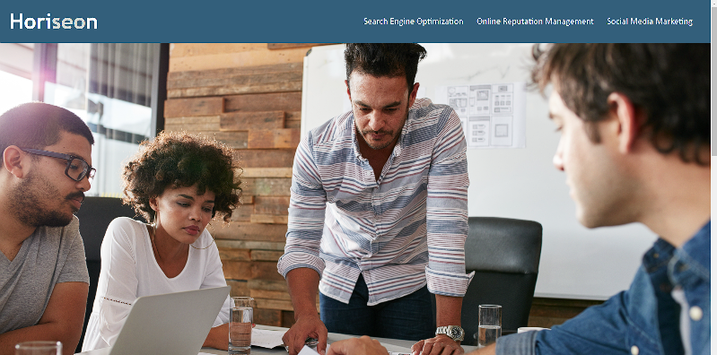

# Horiseon Webpage

## Table of Contents

*[What](#what)

*[Screenshot](#screenshot)

*[what-I-learned](#what-i-learned)

*[Links](#links)

## What

We here at Horiseon strive for optimization. Through Online reputation management and social media marketing, we bring your brand to the people. With all that in mind,
we decided our outdated website needed and overhaul. We used the recently introduced semantic tags to greatly improve the optimization of our site's structure. This has made it easier to identify different sections for accessability. Due to the semantic changes, we also had to update our style sheets to match the new tags. They were also re organized to 
make more logical sense. Comments were added to divide up the css and make it more manageable.

## Screenshot

## What I Learned

Through updating this website I have seen just how much goes into the layout and thought process for coding. I have seen that the old addage save often still applies. I enjoyed changing something in the HTML and then saving and refreshing my browser to see what was broken. I look forward to having more challenges set before me.

## Links

https://bmkersey.github.io/Week1Challenge/